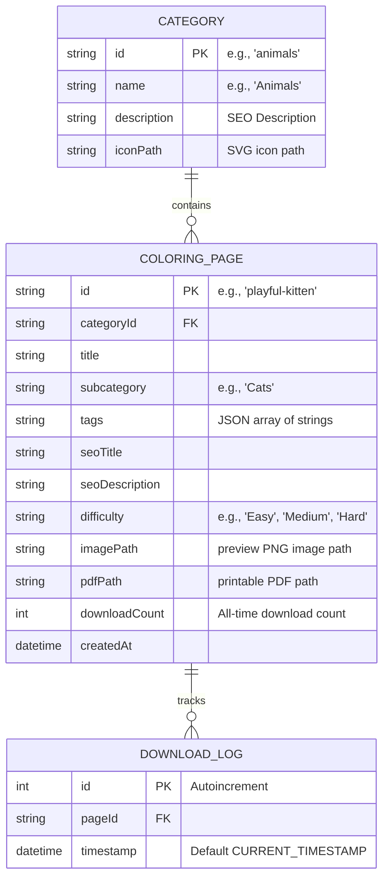

# Coloring Pages Website Design Document

**Date**: 2026-05-22  
**Author**: Antigravity Agent  
**Aesthetic Theme**: Classic & Family-friendly (Warm pastel tones, soft rounded borders, hand-drawn styles)  
**Architecture**: Full-Stack Next.js (App Router) + SQLite + File-based Agent Sync

---

## 1. Overview & Goals
The goal of this project is to build a highly responsive, SEO-optimized, and premium coloring pages website for kids and adults. 
The website will:
*   Organize thousands of coloring sheets into simple, beautiful categories using circular/square cards.
*   Automate ingestion: AI agents will drop high-resolution images, printable PDFs, and JSON metadata into structured folders. A sync script automatically scans and indexes them.
*   Track downloads dynamically to maintain a "Top Trending Pages" and "Top Trending Categories" section.
*   Integrate standardized Google AdSense ad slots seamlessly in a clean, non-intrusive way.

---

## 2. Visual & UI Design System
We adopt a **Classic & Family-friendly** style that feels premium, professional, and accessible to parents, children, and teachers:
*   **Color Palette**:
    *   *Background*: Soft Off-White/Cream (`#FAF8F5`) for warmth.
    *   *Typography*: Dark Slate/Charcoal (`#2D312E`) for highly readable text.
    *   *Accent Primary (Sage Green)*: `#E2ECE9` background, `#4D6D65` text.
    *   *Accent Secondary (Peach/Apricot)*: `#FDF0E6` background, `#C96E3E` text.
    *   *Accent Tertiary (Sky Blue)*: `#E6F0FA` background, `#3E77B4` text.
    *   *Accent Quaternary (Lavender)*: `#F3E8FA` background, `#7D4DA3` text.
*   **Typography**:
    *   Headings: Modern rounded typography (e.g., *Quicksand* or *Outfit* via Google Fonts).
    *   Body text: Highly legible sans-serif (*Inter* or *Nunito*).
*   **Borders & UI Elements**:
    *   Soft rounded borders (`border-radius: 16px` to `24px`).
    *   Subtle hand-drawn bordered effects (`border: 2px solid #EFEAE2`).
    *   Light micro-animations (e.g., 2% card lifts and soft hover background color changes).

---

## 3. Database Architecture (SQLite)
To support dynamic trending downloads and category aggregation, we use SQLite. SQLite is highly performant locally, has zero external service dependencies, and is easy to modify and backup.

### Tables & Relationships



---

## 4. Agent Ingestion & Sync Workflow
To automate content creation, we build a seamless **Filesystem-to-Database** synchronization bridge. AI agents will run asynchronously to generate artwork and simply drop files into the project structure.

### Filesystem Layout
Agents place assets here:
```text
public/content/
  └── <category-id>/
      └── <page-id>/
          ├── image.png         (optimized 800px preview PNG)
          ├── printable.pdf     (high-resolution printable A4/Letter PDF)
          └── metadata.json     (JSON file with tags, difficulty, and SEO copy)
```

### `metadata.json` Schema
```json
{
  "id": "playful-kitten",
  "title": "Playful Kitten Coloring Page",
  "category": "Animals",
  "subcategory": "Cats",
  "tags": ["cat", "kitten", "cute", "pets"],
  "seoTitle": "Free Playful Kitten Coloring Page (Printable PDF)",
  "seoDescription": "Download and print this adorable playful kitten coloring page. Perfect for kids, classrooms, and animal lovers. High-resolution free PDF format.",
  "difficulty": "Easy",
  "author": "Antigravity Agent"
}
```

### Sync Script Flow (`scripts/sync.js`)
On server startup (`next dev`, `next start`) or during build (`npm run build`), an automated script parses `public/content/`:
1.  **Reads all subdirectories** to detect active category folders.
2.  Creates or updates `Category` records dynamically.
3.  **Parses all `metadata.json`** files inside child directories.
4.  Performs an `upsert` in SQLite:
    *   If the page exists: Updates title, subcategory, tags, and SEO metadata. **Retains** the existing `downloadCount`.
    *   If the page is new: Inserts a new record with `downloadCount = 0`.
5.  **Clean-up/Prune**: Queries the DB for active records. If a page or category is present in the DB but missing from the disk, it is deleted from SQLite.

---

## 5. Trending & Analytics Systems
To calculate "Top Pages" and "Top Categories" dynamically:
1.  **Download Event Capture**: When a user clicks "Download PDF", a client event requests the route: `GET /api/download?id=playful-kitten`.
    *   The route handler registers an insertion in `DOWNLOAD_LOG` and increments `downloadCount` in `ColoringPage`.
    *   It immediately redirects the client to the high-resolution PDF `public/content/animals/playful-kitten/printable.pdf` or returns a file buffer to force download.
2.  **Sliding Window Trending Score**:
    *   **All-Time Top**: Ordered by `downloadCount` descending.
    *   **Weekly Trending**: Ordered by the number of entries in `DOWNLOAD_LOG` where `timestamp >= datetime('now', '-7 days')`.
    *   This keeps the homepage "Trending" and "Featured" elements fresh and exciting.

---

## 6. Google AdSense Layout Strategy
To maximize revenue without compromising the clean, kid-friendly UX, we reserve standard-sized responsive Google AdSense containers.

### Page Ad Placements
1.  **Home Page / Landing Page**:
    *   *Ad Slot 1 (Top Leaderboard)*: `728x90` (desktop) or `320x100` (mobile) centered right below the main Navigation header and above the hero content.
    *   *Ad Slot 2 (In-Feed Grid)*: Centered within the Category list grid, behaving like a card container but styled clearly as `"Advertisement"`.
2.  **Category Listing Page**:
    *   *Ad Slot 1 (Top Leaderboard)*: Centered above page content.
    *   *Ad Slot 2 (Sidebar)*: A vertical skyscraper (`160x600` or `300x600`) on large desktop monitors.
3.  **Coloring Page Detail Page**:
    *   *Ad Slot 1 (Leaderboard)*: Placed right above the Page Title/Breadcrumbs.
    *   *Ad Slot 2 (Under Download)*: A `300x250` Medium Rectangle placed directly below the preview image or primary download block.
    *   *Ad Slot 3 (Sidebar / Side rail)*: `300x600` adjacent to the instructional content on large desktops.

### Ad Placeholders
All Ad units are wrapped in custom CSS boxes (`.ad-container`) that reserve layout space to prevent **Cumulative Layout Shift (CLS)**, which is crucial for both SEO rankings and smooth user experience.

---

## 7. SEO & Page Architecture

### Routing Structure
*   `/`: Home Page with hero, Category cards grid, and "Top Trending Pages".
*   `/category/[category-id]`: List of all pages within a category, sorted optionally by popularity or date, featuring SEO subheadings (e.g., "Cats", "Dogs" under "Animals").
*   `/coloring-page/[page-id]`: Detailed page showing high-res preview image, primary "Download & Print PDF" CTA button, printing details, standard ads, and related suggestions.
*   `/trending`: Dedicated page displaying all top trending pages and popular categories.

### SEO Best Practices
*   **Dynamic Title and Meta Tags**: Powered by `generateMetadata()` reading from SQLite.
*   **Semantic HTML5 markup**: `<header>`, `<main>`, `<section>`, `<aside>`, `<footer>`.
*   **JSON-LD Schema**: Injecting `CreativeWork` microdata into individual coloring sheet templates so search engines display optimized print cards in Google Images and standard search results.
*   **Alt Text Automation**: Every preview image automatically receives an optimized title tag, alt tag, and descriptive caption.
